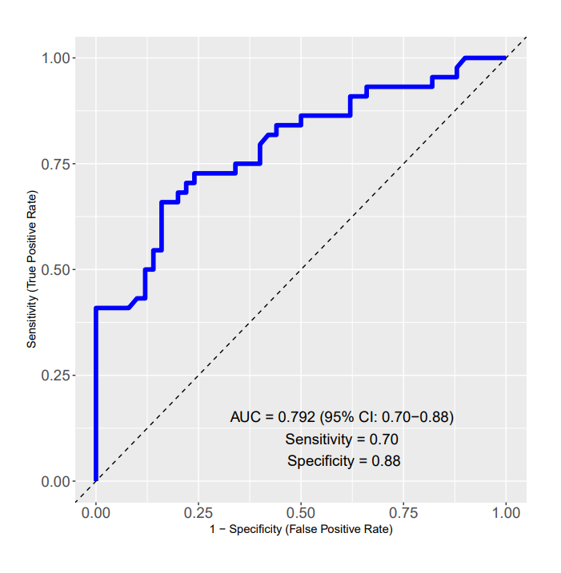

The function is designed to create a predictive model using random forest classification to distinguish between two discrete variables. 
It employs 10-fold cross-validation to evaluate model performance, selecting the factor column with two levels for classification. 
The data is split into a 70/30 ratio, with 70% for training and 30% for testing. 
The function then fits the random forest model to the training data, computes performance metrics such as AUC (Area Under the Curve), 
and generates a ROC curve. The resulting plot is saved as a PDF. This approach allows for robust evaluation and visualization of the model's 
classification performance, using only your expression matrix (converted into a data frame) as the only input eliminating the time needed to 
prepare the data prior to building the model.

